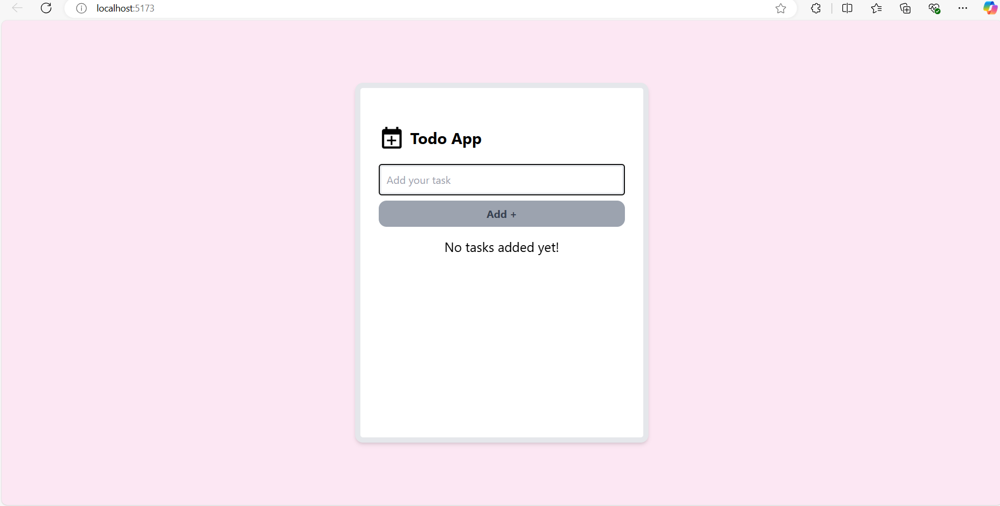
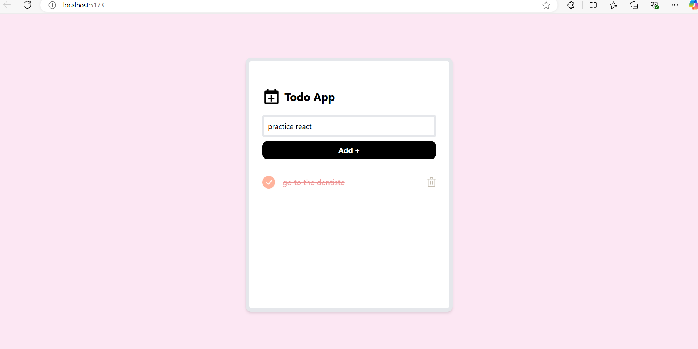

                            Todo App - React

Une application de gestion de tâches simple, développée avec React, permettant aux utilisateurs d'ajouter, supprimer et marquer des tâches comme terminées. L'application persiste les tâches dans localStorage pour qu'elles soient conservées même après un rechargement de la page.

- Table des matières
- Description du projet
- Défis rencontrés
- Solutions trouvées
- Apprentissages clés
- Améliorations potentielles
- Captures d'écran

        1. Description du projet

Cette application de liste de tâches ("Todo App") permet à un utilisateur d'ajouter des tâches, de les marquer comme terminées, et de les supprimer. Les données sont stockées dans localStorage, de sorte que les tâches restent intactes même après un rafraîchissement de la page.

        2. Défis rencontrés

a. Gestion des événements pour ajouter une tâche :

Un des premiers défis a été de s'assurer que le bouton "Ajouter" ne soit activé que lorsque l'utilisateur entre un texte valide. Nous avons dû gérer l'état de l'entrée utilisateur, vérifier qu'elle n'est pas vide, et mettre à jour la liste des tâches de manière correcte.

b. Suppression d'une tâche :

Le deuxième défi était de gérer la suppression des tâches. Pour cela, il a fallu maintenir un index unique pour chaque tâche et mettre à jour l'état en enlevant l'élément correct de la liste.

c. Persistance des données avec localStorage :

La persistance des tâches était un autre défi, car l'application doit garder la trace des tâches même après que l'utilisateur recharge la page. Nous avons donc utilisé le localStorage pour stocker et récupérer les tâches au démarrage de l'application.

        3. Solutions trouvées

a. Ajout de tâches avec un champ contrôlé et un bouton désactivé :
Nous avons utilisé un champ de saisie contrôlé avec React et un bouton qui est désactivé tant que l'entrée est vide. Cela empêche les utilisateurs d'ajouter des tâches vides.

Extrait de code (Ajout de tâche) :

    jsx
    Copier le code
    const add = (inputText) => {
    if (inputText.trim()) {
        setTasks((prevTasks) => [
        ...prevTasks,
        { text: inputText, completed: false }
        ]);
    }
    };

b. Suppression de tâches via un filtre :

Pour supprimer une tâche, j'ai utilisé la méthode filter() qui supprime la tâche à l'index spécifié, en mettant à jour l'état de la liste des tâches.

    Extrait de code (Suppression de tâche) :

    jsx
    Copier le code
    const deleteTask = (indexToDelete) => {
    setTasks((prevTasks) => prevTasks.filter((_, index) => index !== indexToDelete));
    };

c. Persistance des tâches avec localStorage :

Les tâches sont sauvegardées dans localStorage à chaque modification de l'état. Nous avons également chargé les tâches au démarrage de l'application pour récupérer celles qui étaient précédemment enregistrées.

    Extrait de code (Utilisation de localStorage) :

    jsx
    Copier le code
    useEffect(() => {
    const savedTasks = localStorage.getItem('tasks');
    if (savedTasks) {
        setTasks(JSON.parse(savedTasks));  // Charger les tâches depuis localStorage
    }
    }, []);

    useEffect(() => {
    if (tasks.length > 0) {
        localStorage.setItem('tasks', JSON.stringify(tasks));  // Sauvegarder les tâches dans localStorage
    }
    }, [tasks]);
       
       
4. Apprentissages clés

Voici les principaux apprentissages tirés de ce projet :

Gestion de l'état avec useState et useEffect : Apprendre à gérer l'état dans une application React, en particulier avec des tableaux (comme la liste des tâches). Nous avons utilisé useState pour gérer les tâches et useEffect pour persister les données dans le localStorage.

Gestion des événements en React : L'un des défis majeurs a été de gérer les événements (comme l'ajout et la suppression des tâches) de manière réactive, ce qui permet d'assurer une expérience utilisateur fluide.

Manipulation du DOM avec React : Apprendre à mettre à jour le DOM de manière déclarative en fonction de l'état des données.

Utilisation de Tailwind CSS pour le design : Utiliser Tailwind pour styliser l'application de manière rapide et flexible.

        5. Améliorations potentielles

Modification des tâches : 

Actuellement, l'application permet uniquement d'ajouter et de supprimer des tâches. Une amélioration majeure serait d'ajouter la possibilité de modifier une tâche après sa création.

Filtrage des tâches par statut : 

Ajouter des fonctionnalités pour filtrer les tâches par statut ("Toutes", "Complètes", "Incomplètes").

Notifications et confirmations :

 Ajouter des notifications lorsque des tâches sont ajoutées ou supprimées, afin de fournir un retour plus clair à l'utilisateur.

Ajout de priorités ou catégories : 

Permettre à l'utilisateur de définir des priorités ou de classer les tâches par catégories (par exemple, "Travail", "Personnel").

Sources : https://www.youtube.com/watch?v=WE8aYoGK0Ec&t=754s

        6. Captures d'écran
Voici une capture d'écran de l'application en fonctionnement, montrant l'interface de la liste de tâches avec les options d'ajout, suppression et marquage des tâches :

 